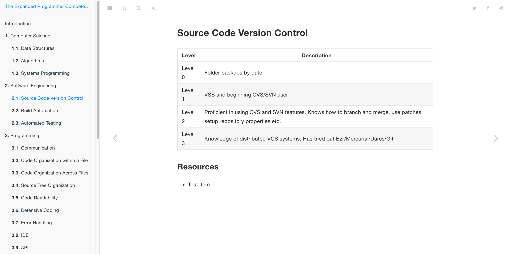

# The Expanded Programmer Competency Matrix

A book idea which focuses on what core skills a developer will need to succeed in the field. This project has been archived for now.

## Screenshot

### A sample chapter

## Gitbook link

A link of the Gitbook can be found by going [here](https://digitalmockingbird.gitbooks.io/competency/content/).

## Credit

The idea for this book's structure is from [Sijin Joseph's Programmer Competency Matrix](http://sijinjoseph.com/programmer-competency-matrix/).